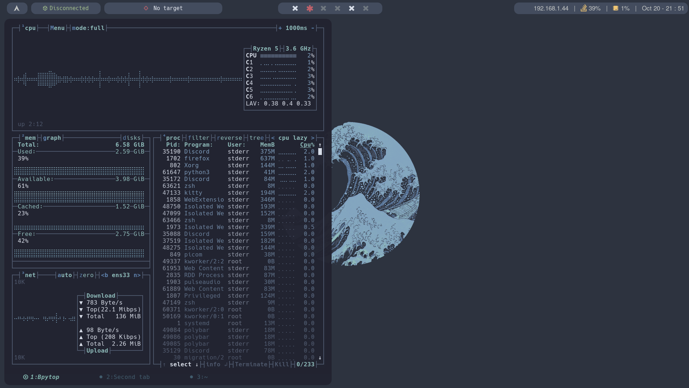

## Entorno



- WM: bspwm
- Menu: rofi
- Bar: polybar
- Terminal: kitty
- Text editor: nvim

## Automatic arch installation

Run this command to run an automatic arch linux installation script:

```
curl -s https://raw.githubusercontent.com/nahuelrm/arch-dotfiles/main/scripts/arch-install/arch-install -o arch && chmod +x arch && ./arch
```

## Automatic post install

Run this command to automatically do all post install stuff:

```
curl -s https://raw.githubusercontent.com/nahuelrm/arch-dotfiles/main/scripts/post-install/post-install -o post-install && chmod +x post-install && ./post-install
```

## Arch linux installation guide
[manuals/arch-install-commands.md](arch-install-commands.md)

## BINDS LIST

### bspwm binds (sxhkd)
	
`$HOME/.config/sxhkd/sxhkdrc`

| Action | Bind |
| :--- | :--- |
| Open terminal | `mod + enter` |
| Program launcher (rofi) | `mod + d` |
| Quit bspwm | `mod + alt + q` |
| Restart bspwm | `mod + alt + r` |
| Close and kill | `mod + w` |
| Alternate layout | `mod + m` |
| Screenshot | `mod + shift + s` |
| Open firefox | `mod + shift + f` |

### Kitty binds

| Action | Bind |
| :--- | :--- |
| New window | `ctrl + shift + enter` |
| Move neighbor window | `alt + arrows |
| Close window | `ctrl + shift + w` |
| Resize window | `ctrl + shift + r` |
| Change windows layout | `ctrl + shift + l` |
| Zoom up window | `ctrl + shift + z` |
| Open new tab | `ctrl + shift + t` |
| Rename new tab | `ctrl + shit + alt + t` |
| Move in tabs | `ctrl + shift + arrows` |
| Close tab | `ctrl + shift + w` |
| Move tabs | `ctrl + shift + {, or .}` |

### Fzf binds

| Action | Bind |
| :--- | :--- |
| List files and folders in current directory | `ctrl + t` |
| Reach history of shell commands | `ctrl + r` |
